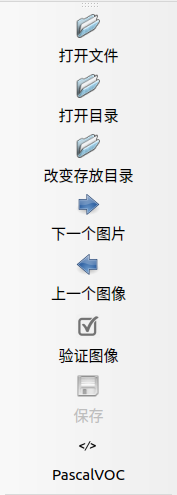

# 目标检测数据集制作

## 数据集采集和归档

将数据集放入如下目录

```shell
DATASET_DIR=/path/to/dataset
```

> 需要注意的是，数据集通常需要放置在项目外的路径，例如 `~/data` （推荐）。如果放置在项目内，导致编辑器对于项目的索引过大，会导致编辑器卡顿

这里准备好了一个示例数据集，可以下载

```shell
wget -P ~/data https://github.com/HenryZhuHR/deep-object-detect-track/releases/download/v1.0.0/bottle.tar.xz
tar -xvf ~/data/bottle.tar.xz -C ~/data
mv ~/data/bottle ~/data/yolodataset
```

随后可以设置数据集目录为
```shell
DATASET_DIR=~/data/yolodataset
```

参考该目录构建自己的数据集，并且完成标注

考虑到单张图像中可能出现不同类别的目标，因此数据集不一定需要按照类别进行划分，可以自定义划分，按照项目的需求任意归档数据集，但是请确保，每一张图像同级目录下有同名的**标签文件**

按照类别划分的目录结构参考
```shell
·
└── /path/to/dataset
    ├── class_A         
    │   ├─ file_A1.jpg  
    │   ├─ file_A1.xml     
    │   └─ ...
    └── class_B       
        ├─ file_B1.jpg   
        ├─ file_B1.xml   
        └─ ...
```

不进行类别划分的目录结构参考
```shell
·
└── /path/to/dataset    
    ├─ file_1.jpg  
    ├─ file_1.xml     
    └─ ...
```


## 启动标注工具

使用 labelImg 标注，安装并启动
```shell
pip install labelImg
labelImg
```

在 Ubuntu 下启动后的界面如下（Windows 版本可能略有差异）


<!--  -->

- 打开文件 : 标注单张图像（不推荐使用）
- **打开目录** : 打开数据集存放的目录，目录下应该是图像的位置
- **改变存放目录**: 标注文件 `.xml` 存放的目录
- 下一个图片: 
- 上一个图像: 
- **验证图像**: 验证标记无误，用于全部数据集标记完成后的检查工作
- **保存**: 保存标记结果，快捷键 `Ctrl+s`
- **数据集格式**: 选择 `PascalVOC` ，后续再转化为 `YOLO`

点击 `创建区块` 创建一个矩形框，画出范围


每个类别都有对应的颜色加以区分


完成一张图片的标注后，点击 `下一个图片`

- labelImg 快捷键

| 快捷键 |           功能           | 快捷键 |       功能       |
| :----: | :----------------------: | :----: | :--------------: |
| Ctrl+u |    从目录加载所有图像    |   w    |  创建一个矩形框  |
| Ctrl+R |   更改默认注释目标目录   |   d    |    下一张图片    |
| Ctrl+s |     保存当前标注结果     |   a    |    上一张图片    |
| Ctrl+d |   复制当前标签和矩形框   |  del   | 删除选定的矩形框 |
| space  |  将当前图像标记为已验证  | Ctrl+  |       放大       |
|  ↑→↓←  | 键盘箭头移动选定的矩形框 | Ctrl–  |       缩小       |

## 数据处理

运行脚本，生成同名目录，但是会带 `-organized` 后缀，例如
```shell
python dataset-process.py --datadir ~/data/yolodataset
```

生成的目录 `~/data/yolodataset-organized` 用于数据集训练，并且该目录为 yolov5 中指定的数据集路径

如果不需要完全遍历数据集、数据集自定义路径，则在 `get_all_label_files()` 函数中传入自定义的 `custom_get_all_files` 函数，以获取全部文件路径，该自定义函数可以参考 `default_get_all_files()`

```python
def default_get_all_files(directory: str):
    file_paths: List[str] = []
    for root, dirs, files in os.walk(directory):
        for file in files:
            file_paths.append(os.path.join(root, file))
    return file_paths
```

并且在调用的时候传入该参数

```python
# -- get all label files, type: List[ImageLabel]
label_file_list = get_all_label_files(args.datadir) # [!code --]
label_file_list = get_all_label_files(          # [!code ++]
    args.datadir,                               # [!code ++]
    custom_get_all_files=default_get_all_files  # [!code ++]
)                                               # [!code ++]
```